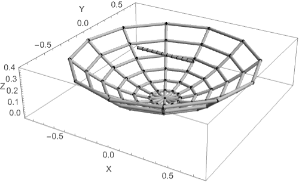
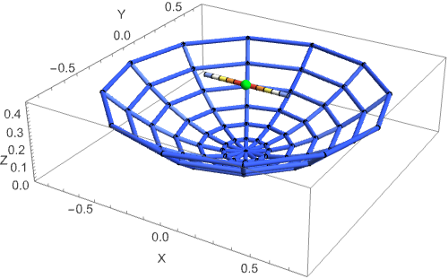
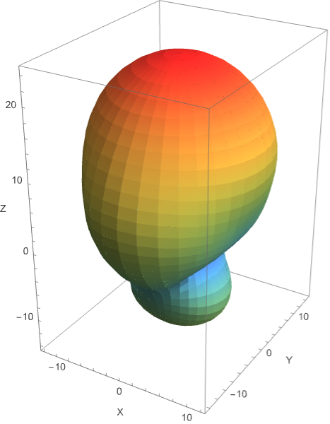

# AntennaLink Examples

Runnable, self-contained examples. Run any of them from the repository root:

```bash
wolfram -script examples/DishAntenna.wl
```

## DishAntenna.wl — front-fed parabolic dish

Builds a wire-grid parabolic reflector (`AntennaParabolicReflector`) with a
half-wave dipole feed at the focal point, then exercises the full workflow:

1. **`AntennaPlotGeometry`** — renders the physical wire structure, with the
   driven feed segment highlighted.
2. **`AntennaFarFieldMemory`** — solves the segment currents in memory and
   computes the far-field gain over a theta/phi grid.
3. **`AntennaPlotPattern3D`** — renders the 3D radiation pattern with the
   antenna geometry overlaid at the center.

Running the script writes three images alongside it and prints the peak gain.
At 300 MHz (≈1.5 λ aperture) the dish produces a forward main lobe of about
**9.1 dBi at boresight** (θ = 0°, the +Z direction), as expected for a
front-fed reflector:

| Geometry | Currents | Radiation pattern |
|---|---|---|
|  |  |  |

Key parameters you can tweak at the top of the script: `frequencyMHz`,
`focalLength`, `dishRadius`, `numRibs`, `numRings`. Increasing the aperture
(in wavelengths) narrows the main beam and raises the gain, at the cost of a
finer mesh and a larger solve.
